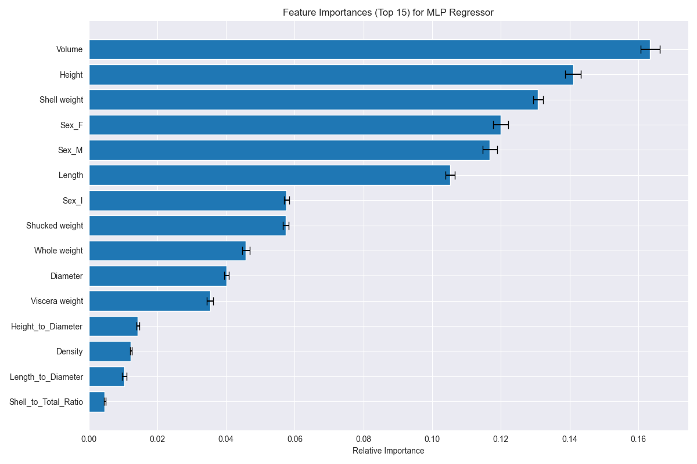

# Abalone Age Detection System

## Overview

This project provides a web application for predicting the age of abalone based
on physical measurements. It consists of:

- **Backend**: FastAPI server hosting an MLP (Multi-Layer Perceptron) Regressor
  model
- **Frontend**: React application with an intuitive interface for data
  submission and visualization
- **ML Model**: Trained scikit-learn MLP Regressor that predicts abalone age
  based on physical characteristics
- [**Live Demo**](https://abalone-age.vercel.app/)

## About Abalone Age Prediction

Abalone age prediction is typically done by counting rings on the shell. This
process is time-consuming and requires expertise, as it involves cutting the
shell, staining it, and counting the rings under a microscope. This system
automates the process using machine learning by analyzing physical measurements
like weight, diameter, height, and other characteristics.

The standard scientific formula for abalone age is: **Age = Rings + 1.5** (in
years).

## Feature Importance

The following features contribute to the prediction model with varying degrees
of importance:



The model uses both raw measurements and engineered features to improve
prediction accuracy. Key engineered features include:

- Volume (Length × Diameter × Height)
- Density (Whole weight / Volume)
- Shell to total weight ratio
- Various dimension ratios

## Architecture

```
┌─────────────┐     ┌─────────────┐     ┌─────────────┐
│    React    │     │   FastAPI   │     │ MLP Model   │
│  Frontend   │────▶│   Backend   │────▶│ (sklearn)   │
└─────────────┘     └─────────────┘     └─────────────┘
```

## Project Structure

```
abalone/
├── backend/                # FastAPI application
│   ├── main.py             # Application entry point
│   ├── AbaloneModel.py     # ML model wrapper
│   ├── models.py           # Pydantic data models
│   ├── routers/            # API route handlers
│   ├── services/           # Business logic
│   ├── models/             # Saved ML models
│   ├── training_scripts/   # Model training scripts
│   │   └── train.ipynb     # Training notebook
│   └── requirements.txt    # Python dependencies
├── frontend/               # React application
│   ├── src/                # React source code
│   │   ├── components/     # Reusable UI components
│   │   ├── pages/          # Page components
│   │   ├── utils/          # Utility functions
│   │   └── App.js          # Main application component
│   ├── public/             # Static assets
│   └── package.json        # JS dependencies
├── plots/                  # Visualization assets
│   └── feature_importance.png  # Feature importance plot
└── run.sh                  # Startup script
```

## Getting Started

### Prerequisites

- Node.js 19.x+ (for local frontend development)
- Python 3.9+ (for local backend development)
- Git

### Installation

1. Clone the repository:

```bash
git clone https://github.com/dixisouls/abalone_age_prediction.git
cd abalone_age_prediction
```

2. Set up and start the application using one of the following methods:

#### Manual Setup

For backend:

```bash
cd backend
python -m venv venv
source venv/bin/activate  # On Windows: venv\Scripts\activate
pip install -r requirements.txt
python main.py
```

For frontend:

```bash
cd frontend
npm install
npm start
```

Or use the provided script:

```bash
chmod +x run.sh
./run.sh
```

3. Access the application at http://localhost:3000

## API Documentation

The API documentation is available at http://localhost:8000/docs when the
backend is running.

### Key Endpoints

- `POST /api/predict`: Submit abalone measurements and get age prediction
- `GET /api/info`: Get information about the current model

## Input Features

| Feature        | Type        | Description                 | Units |
| -------------- | ----------- | --------------------------- | ----- |
| Sex            | Categorical | M, F, and I (infant)        |       |
| Length         | Continuous  | Longest shell measurement   | mm    |
| Diameter       | Continuous  | Perpendicular to length     | mm    |
| Height         | Continuous  | With meat in shell          | mm    |
| Whole_weight   | Continuous  | Whole abalone               | grams |
| Shucked_weight | Continuous  | Weight of meat              | grams |
| Viscera_weight | Continuous  | Gut weight (after bleeding) | grams |
| Shell_weight   | Continuous  | After being dried           | grams |

## License

This project is licensed under the MIT License

## Author

Created by [Divya Panchal](https://github.com/dixisouls)
